# Pinnacle 100 LTE-M AWS Out of Box Demo

## Table of Contents

1. **[Introduction](#introduction)**
2. **[Resources](#resources)**
3. **[Prerequisites](#prerequisites)**
4. **[Setup](#setup)**
5. **[Using the Demo](#using-the-demo)**  
   [Signup and Login](#signup-and-login)  
   [Scan for Devices](#scan-for-devices)  
   [Home Page](#home-page)  
   [Provision](#provision)  
   [Device Information](#device-information)  
   [Cellular Settings](#cellular-settings)  
   [Power Settings](#power-settings)  
6. **[Cloud Data](#cloud-data)**  
   [BT510 Sensor Data](#bt510-sensor-data)  
7. **[LED behavior](#led-behavior)**
8. **[Development](#development)**

## Introduction

The Pinnacle 100 Out of Box demo demonstrates gathering sensor data over BLE and sending the data to the cloud (AWS) via LTE-M.
One device that can be used for the demo is the BL654 BME280 sensor. This sensor measures temperature, humidity, and pressure.

Another supported sensor is the BT510. It records temperature and movement. The BT510 can also be configured to detect a door opened/closed.

The Pinnacle 100 scans for the BL654 sensor and connect to the first one it finds. At the same time, the Pinnacle 100 gathers data for the BT510 devices from advertisements without creating a connection.
The demo supports one BL654 sensor and up to fifteen BT510 sensors. The demo can be recompiled to remove support for either sensor.

Using the Laird Pinnacle Connect mobile app, the user can provision the Pinnacle 100 to connect to AWS. Once connected to AWS, the Pinnacle sends BME280 sensor data (if a sensor is found) to the cloud every 60 seconds. 
Once a BT510 is discovered and enabled via the web portal, its sensor data is reported. The details of the BT510 data reporting are detailed [below](#bt510-sensor-data).
```
                XXXXX
              XXX   XXX
    XXXXX   XX        XX
 XXX    XX XX          X XXXXXXX
 X        XX            X       XX
X                                X
 X         AWS Cloud              X
 XX                              X
  XXXXXXX                       XX
        XX          XXXX    XXXX
         XXX      XXX   XXXX
           XXXXXXX
               ^
               +
              LTE-M (MQTT with TLS)
               +
               v
     +---------+----------+
     |                    |
     |  Pinnacle 100 DVK  |
     |                    |
     +---------+----------+
               ^
               +
              BLE
               +-------------------------------+
               v                               v
    +----------+------------+      +-----------+-----------+
    |                       |      |                       |
    |  BL654 BME280 Sensor  |      |  BT510 Sensor (0-15)  |
    |        (0-1)          |      |                       |
    +-----------------------+      +-----------------------+

```

## Resources

- [Pinnacle 100 product page](https://www.lairdconnect.com/wireless-modules/cellular-solutions/pinnacle-100-modem)
- [BT510 Product page](https://www.lairdconnect.com/iot-devices/iot-sensors/bt510-bluetooth-5-long-range-ip67-multi-sensor)

## Prerequisites

The following are required to use the Pinnacle 100 Out of Box demo:

- An activated SIM card. See [here](https://connectivity-staging.s3.us-east-2.amazonaws.com/2020-08/CS-AN-Truphone%20SIM%20Set%20Up%20v1_1.pdf) for instructions on activating the SIM card that came with your dev kit.
- Pinnacle 100 DVK programmed with LTE-M/AWS out of box demo firmware. Releases available [here!](https://github.com/LairdCP/Pinnacle_100_oob_demo/releases)
- Laird Pinnacle Connect app installed on a mobile device
  - [Android app](http://play.google.com/store/apps/details?id=com.lairdconnect.pinnacle.connect)
  - [iOS app](https://apps.apple.com/us/app/laird-pinnacle-connect/id1481075861?ls=1)

## Setup

To set up the demo, follow these steps:

1. Install the activated SIM card into the Pinnacle 100 modem SIM slot.
2. Plug the modem into the dev board.
3. Program the Pinnacle 100 Out of Box demo firmware. See section 3.1.1 of the "Programming Guide" [here](https://www.lairdconnect.com/wireless-modules/cellular-solutions/pinnacle-100-cellular-modem#documentation)
4. On your phone, launch the Pinnacle mobile app and follow the on-screen prompts.

## Using the Demo

### Signup and Login

If you do not have an account, you must create one. Use an email address for the username.

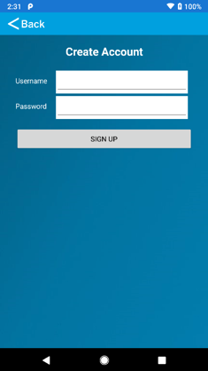 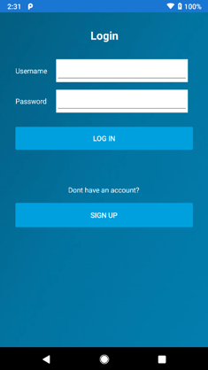  
_Sign-up and Login screens_

### Scan for Devices

Once logged in, the scan screen displays.

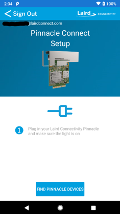  
_Scan screen_

To scan for devices, follow these steps:

1. Click **Find Pinnacle Devices**. Discovered devices are displayed.
   > **Note:** The device name contains the last seven digits of the IMEI of the device so that you can easily identify the device to which you wish to connect. The IMEI is printed on the Pinnacle 100 modem label.

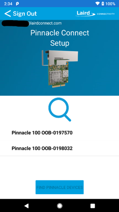  
_Scan screen - devices found_

2. Click on the desired device to connect to it.

### Home Page

The home screen displays status information releated to the OOB demo. From the home page you can commission or decommission the device and navigate to other settings or info pages.

> **Note:** Provisioning is only allowed if the device is in an un-provisioned state.

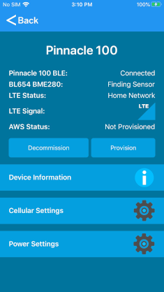  
_Home screen_

### Provision

To provision the device click **Provision**.
During provisioning, certificates are generated for the device and then programmed into the device over BLE.

  
_Provision in process_

Once sending provisioning data is complete, a prompt displays and you are directed back to the information page.

  
_Provisioning is complete_

Once the device is successfully connected to Amazon Web Services (AWS), the provisioning data is committed to non-volatile memory in the Pinnacle 100 modem. If the Pinnacle 100 is then reset or power-cycled, it automatically re-connects to AWS. If the Pinnacle 100 is reset or power cycled before a successful AWS connection, you must re-provision the device.

  
_Device commissioned and connected to AWS_

> **Note:** You can decommission a device if you no longer want it to connect to AWS. Just click **Decommission**

  
_Device decommissioned_

### Device Information

The device information page displays relevant version information of the connected Pinnacle 100 modem.

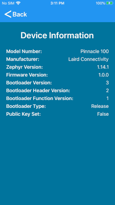  
_Device info_

### Cellular Settings

The cellular settings page displays status information related to the cellular radio and allows the user to change the APN.

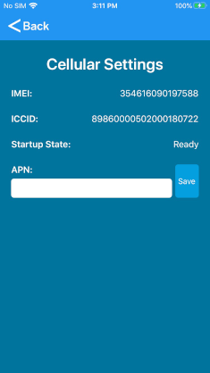  
_Cell settings_

### Power Settings

The power settings page displays the power supply voltage and allows the user to reboot the modem.

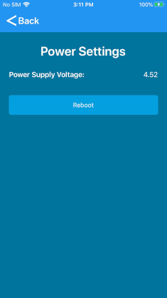  
_Power settings_

## Cloud Data

Once the Pinnacle 100 is commissioned with the mobile app and it is connected to AWS, the user can log into the web portal to view sensor data.

The web portal is located at: <https://demo.lairdconnect.com>

Log in with the same credentials used to login to the mobile app.

Once logged in go to the devices page to see devices that have been added to the user account.

  
_Web portal devices page_

Each pinnacle 100 that is added is identified by its IMEI.

Click on the device ID to display its data.

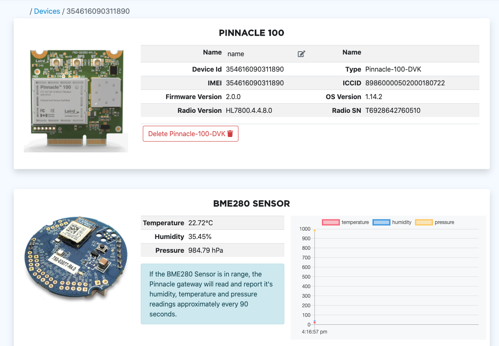  
_Pinnacle 100 data_

If a BME280 sensor is discovered, the Pinnacle 100 connects and reports BME280 sensor data every 60 seconds. The graph only displays live data that is logged while viewing the webpage. If the user leaves the web page and returns, the graph starts over with the most recent data that was received when returning to the page.

### BT510 Sensor Data

If a BT510 sensor is discovered, it displays in the Sensor Network list.

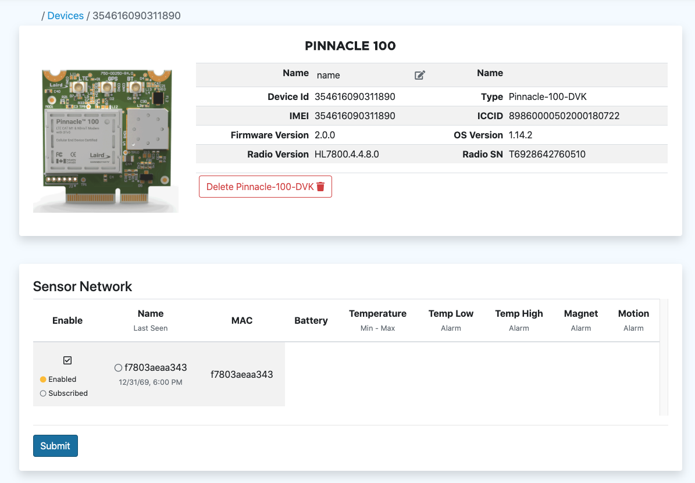  
_BT510 discovered_

In order to receive sensor readings from a BT510 sensor, the sensor must be enabled via the web portal. Click the check box and then hit Submit to enable the sensor.

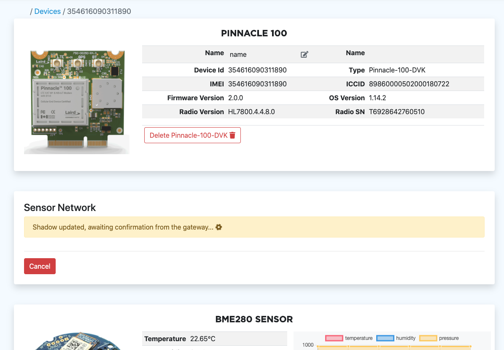  
_BT510 enabling_

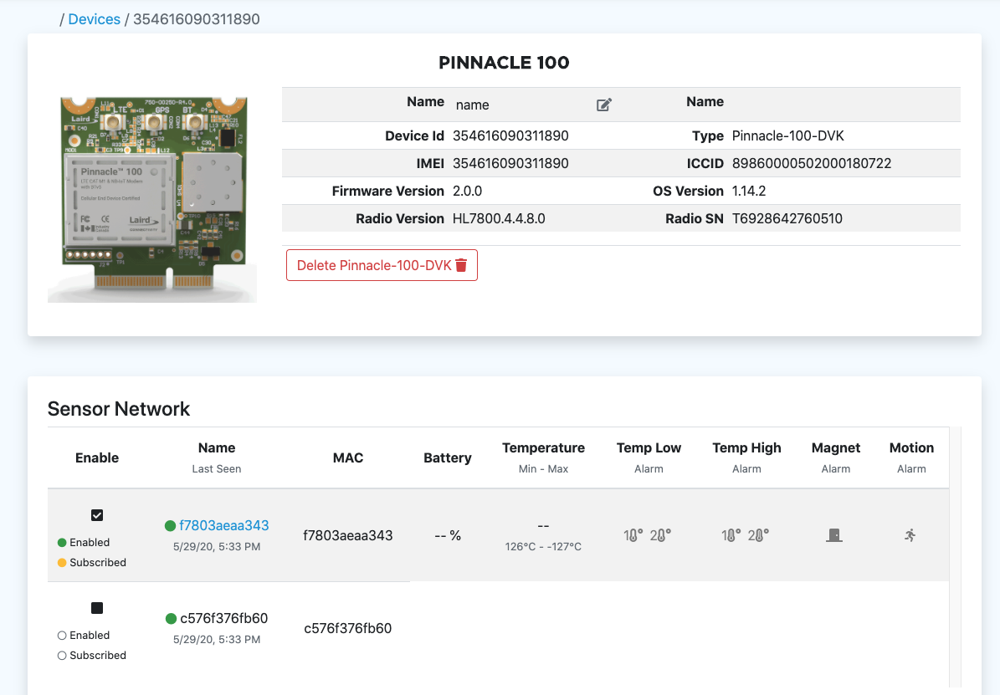  
_BT510 enabled_

Once enabled, it can take up to 30 seconds for the sensor to subscribe. Once subscribed, the sensor begins to send data.

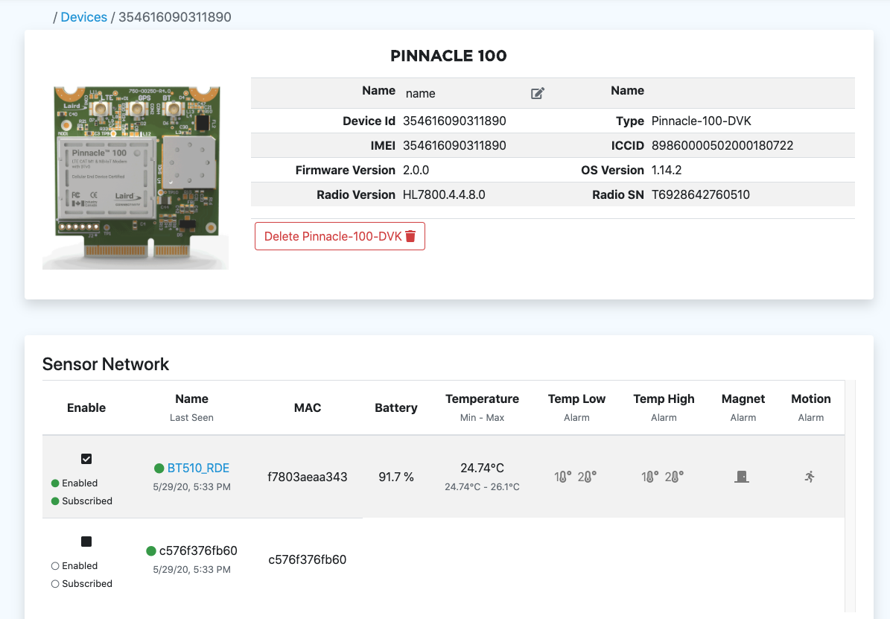  
_BT510 subscribed_

By default a BT510 sensor reports temperature data every two minutes, battery data once an hour, and movement and button presses immediately.

Click on the BT510 sensor name to view the details and settings of the sensor.

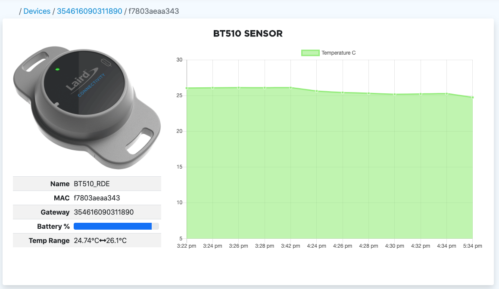  
_BT510 graph_

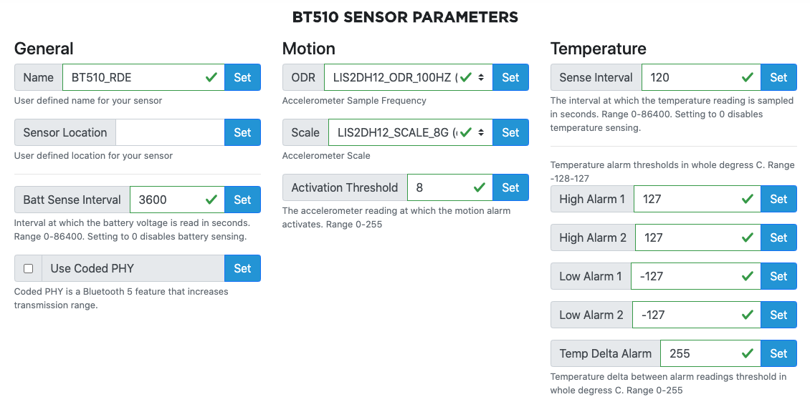  
_BT510 parameters_

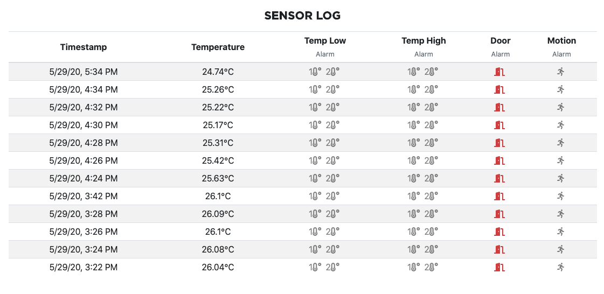  
_BT510 log_

## LED behavior

LED1 - LED4 are all on when the modem is booting.

The Blue LED (LED1) blinks once a second when the Pinnacle is searching for a BL654 sensor. When it finds a sensor and successfully connects to it, the LED remains on.

The Green LED (LED2) turns on when connected to AWS. When data is sent to AWS the LED turns off and then turns back on. When disconnected from AWS, the LED remains off.

The Red LED (LED3) blinks when the Pinnacle is searching for a cellular network. It remains on and does not blink when connected to a network. If there is an error with the SIM card or network registration, then the LED remains off.

## Development
See [here](development.md) for help on getting started with custom development.