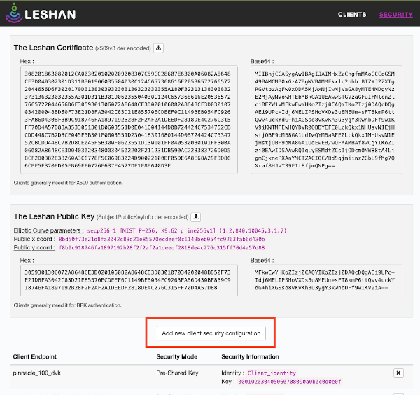
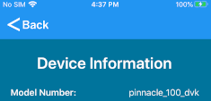
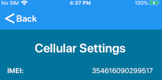
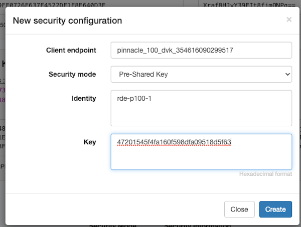
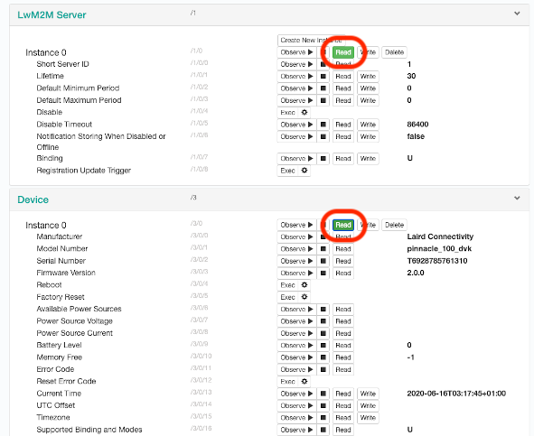
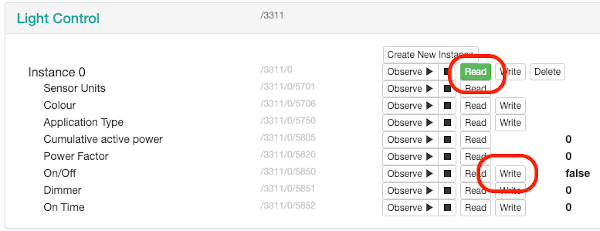

# Pinnacle 100 NB-IoT LwM2M Out of Box Demo

## Table of Contents

1. **[Introduction](#introduction)**
2. **[Resources](#resources)**
3. **[Prerequisites](#prerequisites)**
4. **[Setup](#setup)**
5. **[Using the Demo](#using-the-demo)**
6. **[User Defined Server](#user-defined-server)**
7. **[LED behavior](#led-behavior)**
8. **[Development](#development)**

## Introduction

When using NB-IoT, we do not recommend using the TCP protocol due to the network latencies inherent to NB-IoT. UDP is recommended for NB-IoT data transfer.
This demo is configured to use LwM2M and DTLS with pre-shared keys.  [LightweightM2M (LwM2M)](http://www.openmobilealliance.org/wp/Overviews/lightweightm2m_overview.html) is a protocol that runs on top of [CoAP](https://coap.technology/).

A [Leshan Server](https://www.eclipse.org/leshan/) is used to display information about the Pinnacle 100 DVK and a connected BL654 BME280 sensor.

The software version, model, manufacturer, serial number, and current time can be read. If a BME280 sensor is connected, then temperature, humidity, and pressure can be read. In addition, the green LED on the DVK can be turned on and off using the light control object.

```
                XXXXX
              XXX   XXX
    XXXXX   XX        XX
 XXX    XX XX          X XXXXXXX
 X        XX            X       XX
X                                X
 X       Leshan LwM2M Server      X
 XX                              X
  XXXXXXX                       XX
        XX          XXXX    XXXX
         XXX      XXX   XXXX
           XXXXXXX
               ^
               +
            NB-IoT (LwM2M with DTLS)
               +
               v
     +---------+----------+
     |                    |
     |  Pinnacle 100 DVK  |
     |                    |
     +---------+----------+
               ^
               +
              BLE
               +
               v
    +----------+------------+
    |                       |
    |  BL654 BME280 Sensor  |
    |                       |
    +-----------------------+

```

## Resources

- [Pinnacle 100 product page](https://www.lairdconnect.com/wireless-modules/cellular-solutions/pinnacle-100-modem)

## Prerequisites

The following are required to use the Pinnacle 100 Out of Box demo:

- An activated SIM card. The Truphone SIM card that comes with the DVK does not currently support NB-IoT. If you have purchased a Pinnacle DVK in Europe, then please contact [sales](mailto:melanie.thomas@lairdconnect.com) to obtain a SIM card that is NB-IoT capable.
- Pinnacle 100 DVK programmed with NB-IoT/LwM2M Out of Box demo firmware. Releases available [here!](https://github.com/LairdCP/Pinnacle_100_oob_demo/releases)
- Laird Pinnacle Connect app installed on a mobile device
  - [Android app](http://play.google.com/store/apps/details?id=com.lairdconnect.pinnacle.connect)
  - [iOS app](https://apps.apple.com/us/app/laird-pinnacle-connect/id1481075861?ls=1)

## Setup

To set up the demo, follow these steps:

1. Install the activated SIM card into the Pinnacle 100 modem SIM slot.
2. Plug the modem into the dev board.
3. Program the Pinnacle 100 Out of Box demo firmware. See section 3.1.1 of the Programming Guide [here](https://www.lairdconnect.com/wireless-modules/cellular-solutions/pinnacle-100-cellular-modem#documentation)
4. On your phone, launch the Pinnacle mobile app and follow the on-screen prompts.

## Using the Demo
If the Laird Connectivity Leshan server is used, then the Pinnacle 100 should be configured to something other than its default settings. This allows multiple Pinnacle 100 devices to connect to the same server.

1. Open [Laird Connectivity Leshan web page](http://uwterminalx.lairdconnect.com:8080/#/clients).
2. Go to the Security page.
3. Press "Add new client configuration".

  
_Leshan add device_

4. Using the Pinnacle Connect mobile app, read model number from Device Information page.

  
_Model number_

5. With the mobile app, read IMEI from Cellular Settings page.

  
_IMEI_

6. Enter <model number>_<imei> into the Client endpoint field on the webpage.  For example, pinnacle_100_dvk_354616090287629.
7. Generate a new private shared key using the LwM2M Settings page in the mobile app.
8. Copy the value into the Key field on the webpage.
8. Set and save the Client ID using the mobile app (don't reuse a name that is already present on the server).
9. Put the same name into the Identity field on the web page.

  
_LwM2M settings_

  
_Leshan device config_

10. Reset the modem using the mobile app (Power Settings page) or reset button (SW5 NRF_RESET).
11. From the [clients page](http://uwterminalx.lairdconnect.com:8080/#/clients), click on your device once it is connected to interact with it.
  * Make sure to set the Response Timeout to something greater than 5s at the top of the page. 

  
_Leshan response timeout_

  * Click `Read` at the top of an object to read all child values.  In some cases, not all child values are supported.

  
_Leshan read object_

  * The Light Control object can be used to control the green LED on the dev board. Write `true` or `false` to the On/Off node.

  
_Leshan light control_

## User Defined Server
In addition to the steps in the [Using the Demo](#using-the-demo) section, the Peer URL must be set using the mobile app.

## LED behavior

LED1 - LED4 are on when the modem is booting.

The Blue LED (LED1) blinks once a second when the Pinnacle is searching for a BL654 sensor. When it finds a sensor and successfully connects to it, the LED remains on.

The Green LED (LED2) can be controlled via the LwM2M server Light Control object.

The Red LED (LED3) blinks when the Pinnacle is searching for a cellular network. It remains on and does not blink when connected to a network. If there is an error with the SIM card or network registration, then the LED remains off.

## Development
The LwM2M demo is built with [this overlay config file](../oob_demo/overlay_lwm2m_dtls.conf). See [here](development.md) for help on getting started with custom development.